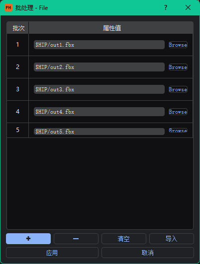

[](##简介) [](##Introduction)

# Portable Houdini

## 简介

Portable Houdini是一个便携的独立的Houdini界面，能够在不开启Houdini的情况下加载HDA文件并调整参数，并支持配置批处理。适合在程序化生成过程中，将HDA与此工具交付给美术使用，无需任何前置知识和依赖安装，即插即用。


## 安装方法

1. 安装对应版本的Python。根据需要安装的Houdini版本所使用的Python版本，安装对应版本的Python，例如Houdini19.0需要安装Python3.7，Houdini19.5需要安装Python3.9。
   如需创建一个即插即用的Python环境，建议步骤如下(Windows)：

   + 从官网下载对应版本的Python安装器，例如[Windows x86-64 executable installer](https://www.python.org/ftp/python/3.9.0/python-3.9.0-amd64.exe)。
   + 使用安装器安装。
   + 将安装器安装的Python环境复制到venv文件下，并重命名为Python37或Python39。Python安装器默认的安装路径为**C:\Users\UserName\AppData\Local\Programs\Python\Pythonxx**。

2. 安装依赖。使用如下代码安装所需模块:

   ```
   python -m pip install requirements.txt
   ```

3. 使用如下代码运行程序:

   ```
   python main.py
   ```

   若在步骤1中在venv文件夹下创建了Python37或Python39环境，那么可以直接双击*run_py37.bat*文件运行。

## 使用方法

1. 初次使用时需要点击**设置>常规设置**以设置Houdini的安装路径。默认安装路径是**C:\Program Files\Side Effects Software\Houdini xx.xx**。
2. 点击**文件>打开HDA**即可打开HDA文件。点击之后会自动读取并绘制**HDA参数界面**。

### 批处理

每个HDA参数右侧都有一个**✚**按钮，可以设置该参数的批处理值。点击之后会打开如下窗口。



按下左下角的**✚**按钮可以增加一个批处理参数值，选中一个批处理参数后点击旁边的 **-** 按钮可以删掉该参数。

批处理参数的意义是——在进行批处理时，会按照批次顺序，将当前批次的HDA属性值设置为对应的属性值进行处理。如果属性在当前批次没有设置属性值，那么会使用**HDA主参数界面的值作为当前批次属性值**。

此外，在打开**按钮**类型的批处理面板时，属性值类型为复选框，若复选框在当前批次的属性值为真(即勾选复选框)，那么当前批次会触发点击该按钮的事件。

设置完批处理参数值后，点击左下角的**应用**即可保存批处理结果。

在HDA参数界面的左下角会显示批处理的批次总数，点击**批处理**按钮即可继续批处理。

## 路线图

> 我写了!=我要做

- [x] 支持文件批处理
- [x] 支持自动Recook开关
- [ ] 支持(几乎)全部变量类型
- [ ] 支持ToolTips
- [ ] 支持变量禁用和隐藏
- [ ] 支持进度条显示
- [ ] 支持设置主题色
- [ ] 支持简单属性窗口文件夹
- [ ] 支持前后端数据双向同步(支持表达式)
- [ ] 支持模型预览

---

## Introduction

Portable Houdini is a portable standalone Houdini interface that allows loading HDA files and adjusting parameters without opening Houdini. It also supports batch processing configuration. This tool is suitable for use in the procedural generation process, allowing artists to use the HDA files with this tool without any prior knowledge or dependency installations. It's truly plug-and-play.


## Installation

1. Install the appropriate version of Python. Install the Python version required by the Houdini version you need. For example, Houdini 19.0 requires Python 3.7, and Houdini 19.5 requires Python 3.9.
   To create a plug-and-play Python environment, follow these steps (for Windows):

   + Download the appropriate version of the Python installer from the official website, such as the [Windows x86-64 executable installer](https://www.python.org/ftp/python/3.9.0/python-3.9.0-amd64.exe).
   + Install Python using the installer.
   + Copy the installed Python environment to the `venv` directory and rename it to `Python37` or `Python39`. The default installation path for the Python installer is **C:\Users\UserName\AppData\Local\Programs\Python\Pythonxx**.

2. Install dependencies. Use the following command to install the required modules:

   ```
   python -m pip install -r requirements.txt
   ```

3. Run the program using the following command:

   ```
   python main.py
   ```

   If you created a `Python37` or `Python39` environment in the `venv` folder in step 1, you can run the program directly by double-clicking the *run_py37.bat* file.

## Usage

1. On first use, you need to click **Settings > General Settings** to set the Houdini installation path. The default installation path is **C:\Program Files\Side Effects Software\Houdini xx.xx**.
2. Click **File > Open HDA** to open an HDA file. Clicking this will automatically read and render the **HDA parameter interface**.

### Batch Processing

Each HDA parameter has a **✚** button on its right side, allowing you to set batch processing values for that parameter. Clicking this button opens the following window.


Pressing the **✚** button at the bottom left adds a batch processing parameter value. Selecting a batch processing parameter and clicking the adjacent **-** button removes that parameter.

The meaning of batch processing parameters is that during batch processing, the HDA attribute value for the current batch will be set to the corresponding attribute value in sequence. If an attribute does not have a set value in the current batch, the **value from the main HDA parameter interface will be used as the attribute value for the current batch**.

Additionally, when opening the batch processing panel for a **button** type parameter, the attribute value type is a checkbox. If the checkbox value for the current batch is true (i.e., the checkbox is checked), the event of clicking that button will be triggered for the current batch.

After setting the batch processing parameter values, click the **Apply** button at the bottom left to save the batch processing results.

The total number of batches is displayed at the bottom left of the HDA parameter interface. Click the **Batch Process** button to continue with batch processing.

## Roadmap

> I wrote != I will do

- [x] Support batch file processing
- [x] Support auto Recook toggle
- [ ] Support (almost) all variable types
- [ ] Support ToolTips
- [ ] Support variable disabling and hiding
- [ ] Support progress bar display
- [ ] Support theme color settings
- [ ] Support simple property window folders
- [ ] Support bidirectional front-end and back-end data synchronization (support expressions)
- [ ] Support model preview
