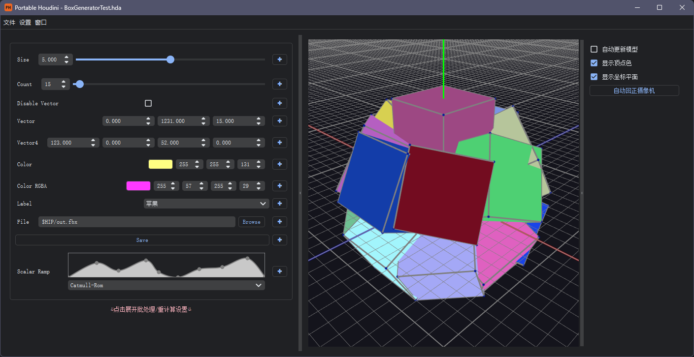

[](#简介) [](#Introduction)

# Portable Houdini

---

## 简介

Portable Houdini是一个便携的独立的Houdini界面，能够在不开启Houdini的情况下加载HDA文件并调整参数，适合在程序化生成过程中，将HDA与此工具交付给美术使用，无需任何前置知识和依赖安装，即插即用。



## 安装方法

1. 安装对应版本的Python。根据需要安装的Houdini版本所使用的Python版本，安装对应版本的Python，例如Houdini19.0需要安装Python3.7，Houdini19.5需要安装Python3.9。
   如需创建一个即插即用的Python环境，建议步骤如下(Windows)：

   + 从官网下载对应版本的Python安装器，例如[Windows x86-64 executable installer](https://www.python.org/ftp/python/3.9.0/python-3.9.0-amd64.exe)。
   + 使用安装器安装。
   + 将安装器安装的Python环境复制到venv文件下，并重命名为Python37或Python39。Python安装器默认的安装路径为**C:\Users\UserName\AppData\Local\Programs\Python\Pythonxx**。

2. 安装依赖。使用如下代码安装所需模块:

   ```
   python -m pip install requirements.txt
   ```

3. 使用如下代码运行程序:

   ```
   python main.py
   ```

   若在步骤1中在venv文件夹下创建了Python37或Python39环境，那么可以直接双击*run_py37.bat*文件运行。

## 使用方法

1. 初次使用时需要点击**设置>常规设置**以设置Houdini的安装路径。默认安装路径是***C:\Program Files\Side Effects Software\Houdini xx.xx**。
2. 点击**文件>打开HDA**即可打开HDA文件。点击之后会自动读取并绘制HDA参数界面。

---

## Introduction

**Portable Houdini** is a portable, standalone Houdini interface that allows loading HDA files and adjusting parameters without opening Houdini. It is suitable for use in the procedural generation process, enabling artists to use the HDA and this tool without any prior knowledge or dependency installations, making it a plug-and-play solution.


## Installation

1. **Install the appropriate version of Python**: Depending on the Houdini version you are using, install the corresponding Python version. For example, Houdini 19.0 requires Python 3.7, while Houdini 19.5 requires Python 3.9.
   
   To create a plug-and-play Python environment, follow these steps (for Windows):

   + Download the appropriate version of the Python installer from the official website, such as [Windows x86-64 executable installer](https://www.python.org/ftp/python/3.9.0/python-3.9.0-amd64.exe).
   + Install Python using the installer.
   + Copy the installed Python environment to the `venv` directory and rename it to `Python37` or `Python39`. The default installation path of the Python installer is **C:\Users\UserName\AppData\Local\Programs\Python\Pythonxx**.

2. **Install dependencies**: Use the following command to install the required modules:

   ```sh
   python -m pip install -r requirements.txt
   ```

3. **Run the program**: Use the following command to run the program:

   ```sh
   python main.py
   ```

   If you created a Python37 or Python39 environment in the `venv` folder in step 1, you can directly run the program by double-clicking the *run_py37.bat* file.

## Usage

1. **Initial Setup**: On first use, click **Settings > General Settings** to set the Houdini installation path. The default installation path is **C:\Program Files\Side Effects Software\Houdini xx.xx**.
2. **Open HDA File**: Click **File > Open HDA** to open an HDA file. The tool will automatically read and render the HDA parameter interface.
